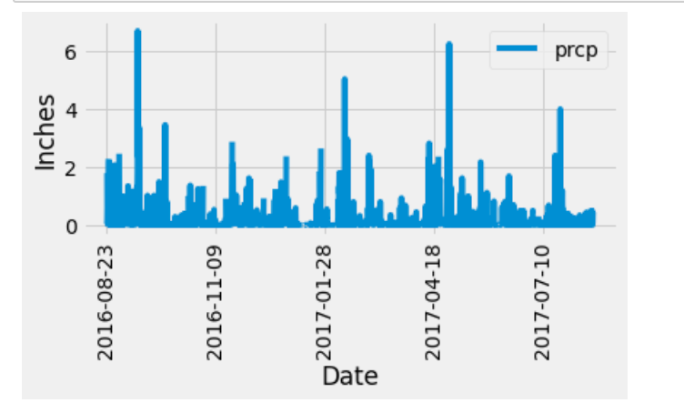
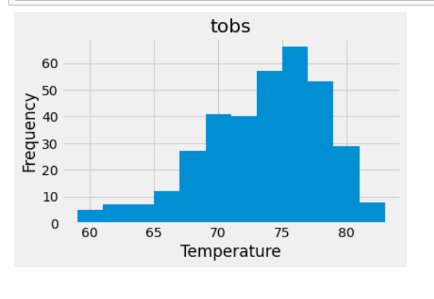
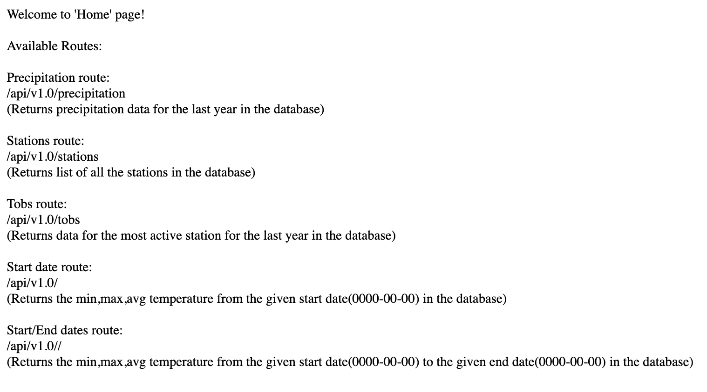
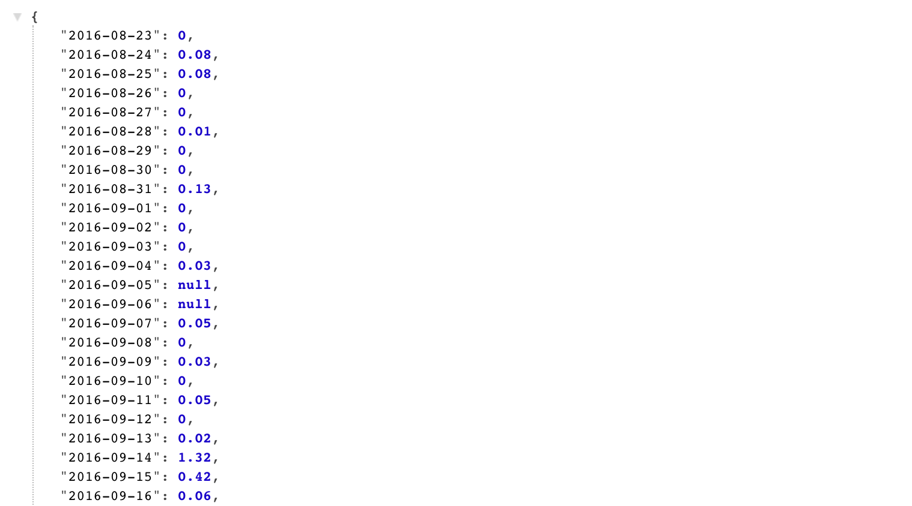
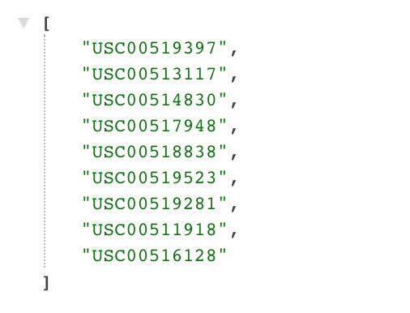
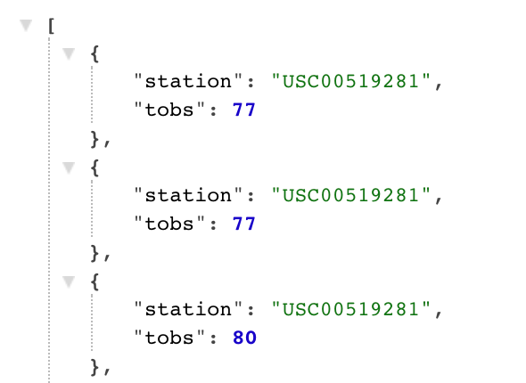
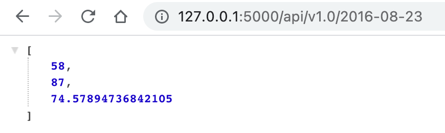
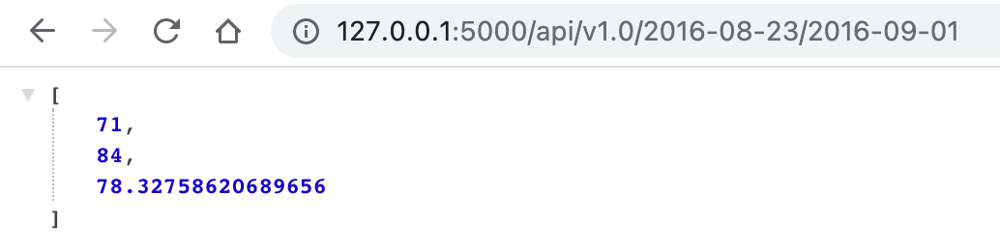

# Climate Analysis SQLAlchemy 

## Step 1 - Climate Analysis and Exploration

* Tables into SQLAlchemy ORM reflected

* Exploratory Precipitation Analysis were done

* Exploratory Station Analysis were done

* Results were plotted using Matplotlib

## Step 2 - Climate App

After completing initial analysis, Flask API was designed to create following routes:

* `/`

  * Home page.

  * All routes that are available listed.
  

* `/api/v1.0/precipitation`

  * The query results to a dictionary using `date` as the key and `prcp` as the value converted.

  * The JSON representation of a dictionary returned.
  

* `/api/v1.0/stations`

  * The JSON list of stations from the dataset returned.
  

* `/api/v1.0/tobs`
  * The dates and temperature observations of the most active station for the last year of data queried. 

  * The JSON list of temperature observations (TOBS) for the previous year returned.
  

* `/api/v1.0/<start>` and `/api/v1.0/<start>/<end>`

  * The JSON list of the minimum temperature, the average temperature, and the max temperature for a given start or start-end range returned.

  * When given the start only, `TMIN`, `TAVG`, and `TMAX` for all dates greater than and equal to the start date calculated.
  

  * When given the start and the end date, the `TMIN`, `TAVG`, and `TMAX` for dates between the start and end date inclusive calculated.
  
